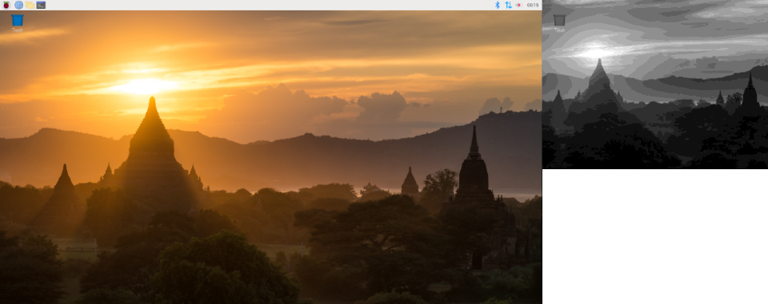

# it8951-pi-desktop

IT8951 as a Raspberry Pi Desktop screen.



Tested on the configuration below:
- Raspberry Pi 3 Model B with Raspberry Pi OS with desktop (Kernel version: 5.4.83-v7+)
- 800x600, 6inch E-Ink display HAT for Raspberry Pi (Brand: WaveShare)

*Special thanks to Julien Boulnois (The author of kernel module for IT8951)*

## Prerequisites

### Raspberry Pi OS with desktop (and recommended software)

You can download Raspberry Pi OS from [the offical web site](https://www.raspberrypi.org/software/operating-systems/#raspberry-pi-os-32-bit).

### raspberrypi-kernel-headers

raspberrypi-kernel-headers are required to build the kernel module.

You can use the apt command to install the headers as follow:

```bash
	sudo apt install raspberrypi-kernel-headers
```

## How to use

### Build

Clone the repository, and build a module.

```bash
	git clone https://github.com/gigoh/it8951-pi-desktop.git
	cd it8951-pi-desktop
	make
```

### Install

Install the module by typing below:

```bash
	sudo make install
``` 

After reboot your pi, you will see the desktop with dual screen.

### Uninstall

Uninstall the module by typing below:

```bash
	$ sudo make uninstall
```

The E-Ink (secondary) display should be disabled after reboot.